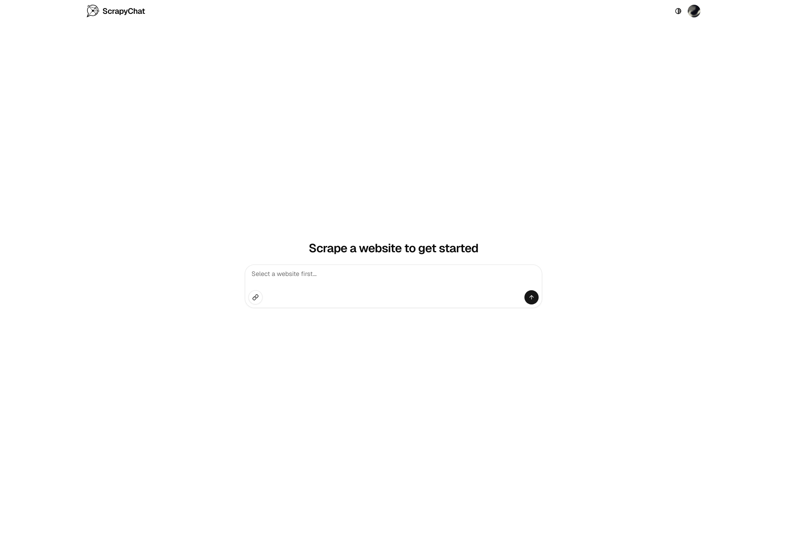
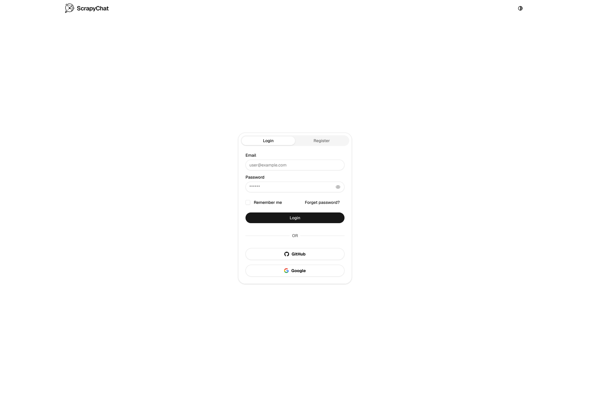

# ScrapyChat

Scrape any website and chat with its content using AI. Ask questions, extract insights, and explore web data conversationally.

## Tech Stack

- **Web**: Next.js 16, React 19, Tailwind CSS, Radix UI, Tanstack Query, motion
- **Auth**: Better Auth, Bun
- **Backend**: FastAPI (Python 3.12), LlamaIndex, Qdrant (vector store), Redis
- **Infrastructure**: Docker Compose, uv, Bun workspaces

## Architecture

```
apps/
├── web/        Next.js frontend (port 3000)
├── auth/       Better Auth server (port 3001)
└── backend/    FastAPI + LlamaIndex API (port 8080)

Services: web, auth, fastapi, postgres, qdrant, redis, ollama
```

## Setup

```bash
# Install dependencies
bun install

# Start all services via Docker Compose
docker network create scrapynet
docker compose up -d
```

## Development

```bash
# Web frontend
bun --bun next dev # runs on :3000

# Auth server (Bun)
bun run dev # runs on :3001

# Backend API (Python)
uv run fastapi dev # runs on :8080
```

## Environment Variables

| Service   | File                  | Key Variables                              |
|-----------|-----------------------|-------------------------------------------|
| Auth      | `apps/auth/.env`      | `DATABASE_URL`, JWT secret, OAuth secrets  |
| Backend   | `apps/backend/.env`  | `QDRANT_ENDPOINT`, `REDIS_HOST`, API keys |
| Web       | `apps/web/.env.local` | `NEXT_PUBLIC_*`                          |

## Linting & Type Checking

```bash
bun run check  # web + auth
uv run nox -l  # backend
```

## Screenshots



```